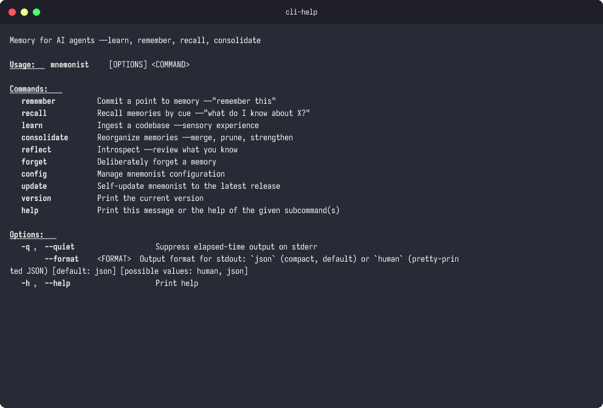

<p align="center">
  <h1 align="center">mnemonist</h1>
  <p align="center">
    An open ecosystem for tool-agnostic AI agent memory.
    <br /><br />
    <a href="#quick-start">Quick Start</a>
    &middot;
    <a href="https://github.com/urmzd/mnemonist/issues">Report Bug</a>
    &middot;
    <a href="spec/mnemonist.md">Specification</a>
  </p>
</p>

<p align="center">
  <a href="https://crates.io/crates/mnemonist"></a>
</p>

<p align="center">
  
</p>

## Features

- **Cognitive CLI** — commands named after memory processes: `memorize`, `remember`, `note`, `learn`, `consolidate`, `reflect`, `forget`
- **Two-level memory** — project (`~/.mnemonist/{project}/`) and global (`~/.mnemonist/global/`)
- **Working memory inbox** — capacity-limited staging area (default 7 items) with attention scoring; items promoted to long-term memory via `consolidate`
- **Memory metadata** — strength, access count, last accessed, source tracking; Hebbian reinforcement on retrieval
- **Plain markdown** with YAML frontmatter — human-readable, git-friendly
- **Typed memories** — user, feedback, project, reference
- **Local embedding** — `candle` crate with `all-MiniLM-L6-v2` (384-dim, CPU/CUDA); no external server needed; model downloads from HuggingFace Hub on first use
- **Layered graph** — three HNSW layers: code (`.code-index.hnsw`), project memory (`.memory-index.hnsw`), and global memory; inter-layer edges via `refs` frontmatter field
- **Pluggable code chunking** — `ChunkingStrategy` trait with built-in `ParagraphChunking` (blank-line boundaries) and `FixedLineChunking` (sliding window with overlap); no tree-sitter dependency
- **Cross-layer recall** — `remember` searches memory and code indices in parallel with blended relevance scoring (semantic + temporal); follows `refs` edges to surface referenced code chunks
- **Consolidation** — `consolidate` promotes inbox items, decays stale memories, and re-embeds
- **Fuzzy forget** — `forget` resolves partial and suffix matches so you don't need the full filename
- **Embedding quality metrics** — `learn` reports anisotropy and similarity_range after indexing
- **TurboQuant** — optional vector quantization (1-4 bit) for compact embedding storage
- **JSON-first** — stdout for structured JSON, stderr for UX; pipe-friendly
- Works with Claude Code, Codex, Gemini, Copilot, Cursor, or any AI tool

## Install

```bash
curl -fsSL https://raw.githubusercontent.com/urmzd/mnemonist/main/install.sh | sh
```

<!-- Rust developers can also install from source with `cargo install mnemonist-cli`. -->

### Hardware acceleration

Pre-built binaries run on CPU with pure Rust matmuls — functional, but large batch operations like `learn` are slower than accelerated builds. If you have a Rust toolchain, you can build from source with hardware acceleration:

```bash
# macOS — Apple's Accelerate BLAS (~2x faster embedding throughput)
cargo install mnemonist-cli --features accelerate

# Linux/Windows with an NVIDIA GPU
cargo install mnemonist-cli --features cuda
```

## Quick Start

```bash
# 1. Install
curl -fsSL https://raw.githubusercontent.com/urmzd/mnemonist/main/install.sh | sh
# Or, if you have a Rust toolchain: cargo install mnemonist-cli

# 2. Ingest the codebase — auto-creates ~/.mnemonist/{project}/ and embeds source files
mnemonist learn .

# 3. Memorize long-term knowledge
mnemonist memorize "prefer Rust for CLI tools" -t feedback
mnemonist memorize "deep Go expertise, new to React" -t user

# 4. Jot quick notes into the working memory inbox
mnemonist note "look into async runtime choices"
mnemonist note "check Linear project INGEST for pipeline bugs"

# 5. Consolidate — promote inbox to long-term memory, decay stale items, re-embed
mnemonist consolidate

# 6. Recall — semantic + text search across memories and code
mnemonist remember "rust async patterns"

# 7. Review everything
mnemonist reflect --all

# 8. Forget something you no longer need (fuzzy name matching)
mnemonist forget prefer-rust
```

## Usage

### Memory Levels

| Level | Location | Scope |
|-------|----------|-------|
| Project | `~/.mnemonist/{project}/` | Per-repo corrections, decisions |
| Global | `~/.mnemonist/global/` | Cross-project preferences, expertise |

Project memory takes precedence over global when they conflict.

### Memory Types

| Type | When | Example |
|------|------|---------|
| `user` | Expertise, preferences | "Deep Rust knowledge, new to React" |
| `feedback` | Corrections, validated approaches | "Never mock the database in tests" |
| `project` | Repo-specific context (project-level only) | "Auth rewrite driven by compliance" |
| `reference` | External resource pointers | "Bugs tracked in Linear project INGEST" |

### CLI at a glance

<p align="center">
  
</p>

### CLI Commands

| Command | Description |
|---------|-------------|
| `mnemonist memorize "<point>" [-t type] [-n name]` | Deliberately encode a point into long-term memory (auto-embeds) |
| `mnemonist note "<point>"` | Jot a quick note into working memory inbox |
| `mnemonist remember "<ask>" [--budget N] [--level both]` | Recall memories by cue — searches memory and code indices in parallel with blended relevance scoring, follows refs |
| `mnemonist learn [path] [--attend glob] [--capacity N]` | Ingest a codebase; chunks files with `ParagraphChunking`, embeds into `.code-index.hnsw`, reports quality metrics |
| `mnemonist consolidate [--dry-run]` | Promote inbox items, decay stale memories, re-embed into `.memory-index.hnsw` |
| `mnemonist reflect [--all] [--global]` | Introspect — review memories and inbox contents |
| `mnemonist forget <file>` | Deliberately forget a memory (supports fuzzy/suffix name matching) |
| `mnemonist config init` | Create default config file |
| `mnemonist config show` | Show current configuration |
| `mnemonist config get <key>` | Get a config value (dot-notation) |
| `mnemonist config set <key> <value>` | Set a config value |
| `mnemonist config path` | Print config file path |

All commands output JSON to stdout (`{"ok": true, "data": {...}}`).

### Working Memory (Inbox)

The inbox is a capacity-limited staging area modeled after human working memory (default capacity: 7). Items enter via `note` (manual) or `learn` (code ingestion) and are scored by attention:

- Items are sorted by attention score; lowest-scored items are evicted at capacity
- `consolidate` promotes inbox items to long-term memory and clears the inbox
- Stored in `.inbox.json` alongside memory files

### Consolidation

`mnemonist consolidate` runs a sleep-like consolidation cycle:

1. **Promote** — inbox items become long-term memories with type and strength
2. **Decay** — memories not accessed within `consolidation.decay_days` (default 90) and below `protected_access_count` (default 5) are pruned
3. **Re-embed** — all surviving memories are re-embedded for fresh semantic search

Use `--dry-run` to preview what would change.

### Memory Metadata

Each memory file tracks cognitive metadata in its frontmatter:

| Field | Description |
|-------|-------------|
| `strength` | Consolidation strength (increases on survival) |
| `access_count` | Retrieval count (Hebbian reinforcement) |
| `last_accessed` | ISO 8601 timestamp of last retrieval |
| `created_at` | When the memory was first created |
| `source` | How it was created: `memorize`, `note`, `learn`, `consolidation` |
| `consolidated_from` | Original files if created via merge |
| `refs` | Inter-layer edges — code chunk IDs or memory filenames this memory links to |

### Configuration

Layered config: `~/.mnemonist/mnemonist.toml` (global default, created with `mnemonist config init`) + `./mnemonist.toml` at the project root (per-project overrides; missing fields inherit).

```toml
[storage]
root = "~/.mnemonist"

[embedding]
provider = "candle"
model = "all-MiniLM-L6-v2"

[recall]
budget = 2000
priority = ["feedback", "project", "user", "reference"]
expand_refs = true
max_ref_expansions = 3

[index]
max_lines = 200

[code]
languages = ["rust", "python", "javascript", "go"]
max_chunk_lines = 100

[inbox]
capacity = 7

[consolidation]
decay_days = 90
merge_threshold = 0.85
protected_access_count = 5
max_memories = 200

[quantization]
enabled = false
bits = 2
algorithm = "mse"
temporal_weight = 0.2
```

Use `mnemonist config set embedding.model all-MiniLM-L6-v2` to change values.

See the full [Specification](spec/mnemonist.md) for details on file format, dynamic loading, precedence rules, and integration guides.

## Benchmarks

<!-- fsrc src="docs/benchmarks.md" -->
### Distance Functions

| Function | 32-d | 128-d | 384-d |
|---|---|---|---|
| `cosine_similarity` | 12 ns | 59 ns | 207 ns |
| `dot_product` | 4 ns | 28 ns | 120 ns |
| `l2_distance_squared` | 5 ns | 30 ns | 125 ns |
| `normalize` | 18 ns | 82 ns | 239 ns |

### HNSW Index (500 vectors, dim=32)

| Operation | Time |
|---|---|
| Build (500 inserts) | 32.7 ms |
| Search top-1 | 15.2 µs |
| Search top-10 | 15.2 µs |
| Search top-50 | 15.2 µs |
| Save to disk | 91 µs |
| Load from disk | 85 µs |

### IVF-Flat Index (500 vectors, dim=32)

| Operation | Time |
|---|---|
| Train (k-means, 16 clusters) | 2.2 ms |
| Search top-1 | 11.9 µs |
| Search top-10 | 12.0 µs |
| Search top-50 | 12.1 µs |
| Save to disk | 66 µs |
| Load from disk | 57 µs |

### TurboQuant MSE (dim=128)

| Bit-width | Quantize | Dequantize |
|---|---|---|
| 1-bit | 3.9 µs | 991 ns |
| 2-bit | 3.9 µs | 988 ns |
| 3-bit | 3.9 µs | 997 ns |
| 4-bit | 4.1 µs | 998 ns |

### TurboQuant Prod (dim=128)

| Bit-width | Quantize | Dequantize | IP Estimate |
|---|---|---|---|
| 2-bit | 116 µs | 141 µs | 111 µs |
| 3-bit | 115 µs | 111 µs | 111 µs |
| 4-bit | 115 µs | 111 µs | 112 µs |

### Bit Packing

| Operation | 128x2b | 384x2b | 384x4b |
|---|---|---|---|
| Pack | 161 ns | 539 ns | 264 ns |
| Unpack | 90 ns | 270 ns | 241 ns |

### Embedding Store

| Operation | 128d x 100 | 384d x 100 | 384d x 500 |
|---|---|---|---|
| `upsert` | TBD | TBD | TBD |
| `get` | TBD | TBD | TBD |
| `remove` | TBD | TBD | TBD |
| `save` | TBD | TBD | TBD |
| `load` | TBD | TBD | TBD |

### Inbox

| Operation | cap=7 | cap=50 |
|---|---|---|
| `push_to_capacity` | TBD | TBD |
| `push_with_eviction` | TBD | TBD |
| `save` | TBD | TBD |
| `load` | TBD | TBD |
| `drain` | TBD | TBD |

### Memory Index

| Operation | 10 entries | 100 entries |
|---|---|---|
| `parse_line` | TBD | — |
| `to_line` | TBD | — |
| `search` | TBD | TBD |
| `upsert_new` | TBD | TBD |
| `upsert_existing` | TBD | TBD |

### Eval Functions

| Function | 32d x 50 | 128d x 50 | 384d x 20 |
|---|---|---|---|
| `anisotropy` | TBD | TBD | TBD |
| `similarity_range` | TBD | TBD | TBD |
| `mean_center` | TBD | TBD | TBD |
| `discrimination_gap` | TBD | — | — |

> Measured on Apple Silicon (M-series) with `cargo bench`. Run `just bench` to reproduce.
> Raw results available in [`docs/benchmarks/`](benchmarks/).
<!-- /fsrc -->

## Testing

```bash
just test                  # cargo test --workspace
bash scripts/validate.sh   # full E2E validation (requires release build)
```

See [CONTRIBUTING.md](CONTRIBUTING.md#testing) for what each test suite covers and per-crate test counts.

## Agent Skill

This repo's conventions are available as portable agent skills in [`skills/`](skills/), following the [Agent Skills Specification](https://agentskills.io/specification).

Related standards: [AGENTS.md](https://agents.md/) · [llms.txt](https://llmstxt.org/)

## License

Apache-2.0
